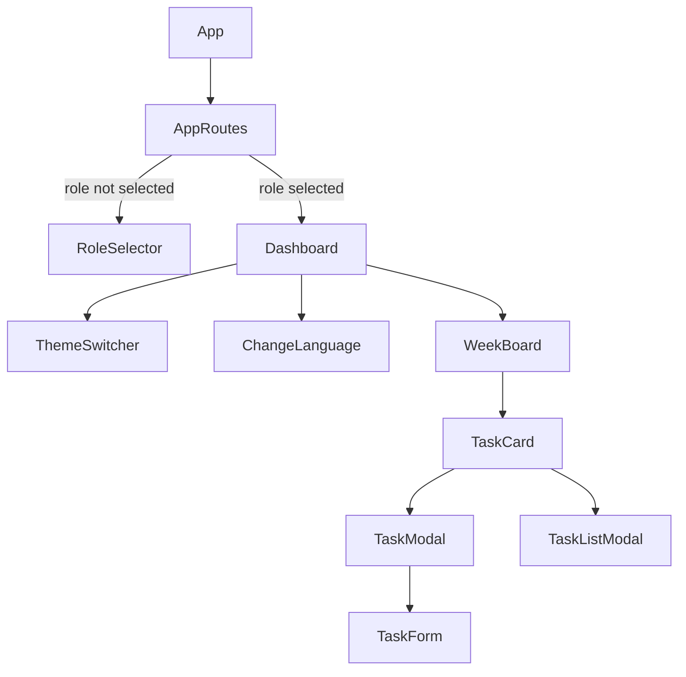

# Interactive Weekly Agenda

A modern, interactive weekly agenda web app built with React. It features task management, role selection, theme switching (light/dark), and language switching (Spanish/English). Designed for students, teachers, administrators, and parents.

---

## 🚀 Features

- **Task Management**: Add, view, and manage tasks for each day of the week.
- **Role Selection**: Choose your role (Administrator, User, Guest) for a personalized experience.
- **Theme Switcher**: Toggle between light and dark mode.
- **Language Switcher**: Instantly switch between English and Spanish.
- **Responsive Design**: Works on desktop and mobile.
- **Modular CSS**: Clean, maintainable, and themeable styles.
- **Unit Testing**: All main components are covered by Jest and React Testing Library.

---

## 🗂️ Folder Structure

```text
interactive-weekly-agenda/
├── public/
├── src/
│   ├── components/
│   │   ├── AppRoutes.jsx
│   │   ├── AppRoutes.test.jsx
│   │   ├── ChangeLanguage.jsx
│   │   ├── ChangeLanguage.test.jsx
│   │   ├── RoleSelector.jsx
│   │   ├── RoleSelector.test.jsx
│   │   ├── TaskCard.jsx
│   │   ├── TaskCard.test.jsx
│   │   ├── TaskForm.jsx
│   │   ├── TaskForm.test.jsx
│   │   ├── TaskListModal.jsx
│   │   ├── TaskListModal.test.jsx
│   │   ├── TaskModal.jsx
│   │   ├── TaskModal.test.jsx
│   │   ├── ThemeSwitcher.jsx
│   │   ├── ThemeSwitcher.test.jsx
│   │   ├── WeekBoard.jsx
│   │   ├── WeekBoard.test.jsx
│   │   └── index.jsx
│   ├── context/
│   │   └── AppContext.jsx
│   ├── pages/
│   │   └── Dashboard.jsx
│   ├── styles/
│   │   ├── base/
│   │   ├── components/
│   │   ├── themes/
│   │   ├── utilities/
│   │   └── index.css
│   └── App.jsx
├── package.json
└── README.md
```

---

## 🧩 Component Architecture



---

## 🎨 Theme & Language System

- **Theme**: Uses CSS variables and the `data-theme` attribute for light/dark mode. All styles are modular and theme-aware.
- **Language**: All UI text is dynamically switched between English and Spanish. Only the visible UI text changes; all code, comments, and variables are in English.

---

## 🛠️ How to Run

1. **Install dependencies:**
   ```bash
   npm install
   ```
2. **Start the development server:**
   ```bash
   npm start
   ```
3. **Open in your browser:**
   [http://localhost:3000](http://localhost:3000)

---

## 🧪 Running Tests

All main components are covered by unit tests using Jest and React Testing Library.

To run all tests:
```bash
npm test
```

---

## 📝 Contributing

1. Fork this repository
2. Create a new branch (`git checkout -b feature/your-feature`)
3. Commit your changes (`git commit -am 'Add new feature'`)
4. Push to the branch (`git push origin feature/your-feature`)
5. Create a new Pull Request

---

## 📄 License

This project is licensed under the MIT License.

---

## 📚 Additional Notes

- All code, comments, and variable names are in English for maintainability.
- UI text is available in both English and Spanish, switchable via the language toggle.
- For more details on the CSS structure, see [`src/styles/README.md`](src/styles/README.md).
